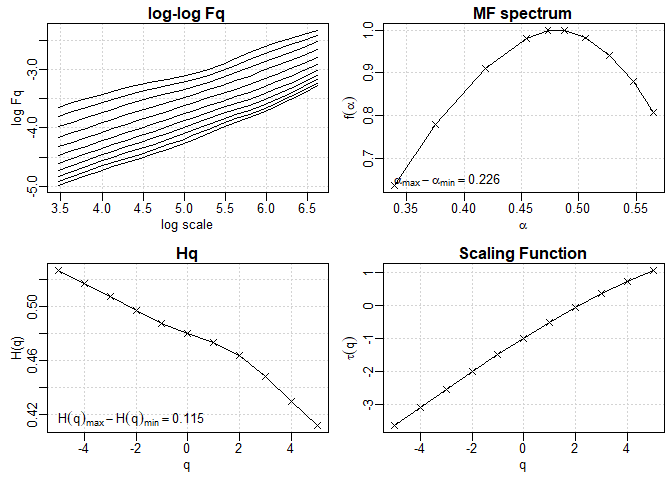
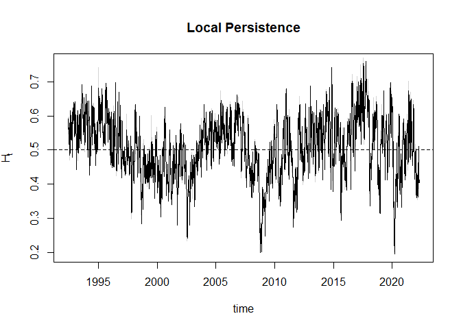
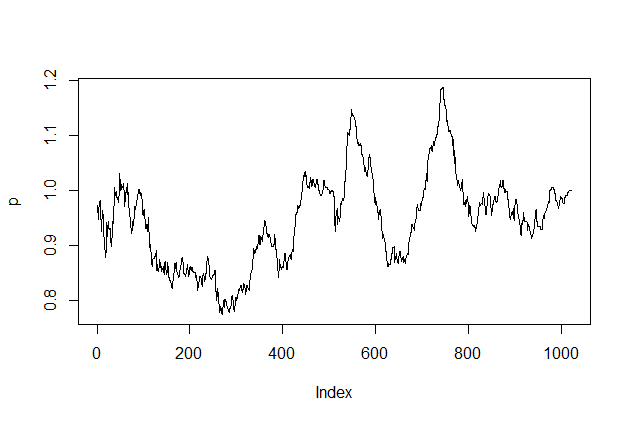

# multifractal

Reference Manual: [multifractal.pdf](multifractal.pdf)

## Overview

This is an improved package for multifractal detrended fluctuation analysis (MF-DFA), simulation of multifractal series, and surroagte analysis (IAAFT, IAAWT). It allows to enhance the robustness and reliability of classic MF-DFA via overlapping windows. It further enables to test the significance of multifractality via IAAFT surrogates. Simulations are based on Mandelbrot's multifractal model of asset returns (MMAR).

## Installation

``` r
    devtools::install_github("wol-fi/multifractal")
```

## Usage

The below example illustrates a multifractal analysis of the S&P 500 stock market index (daily, 1992-2022). The example dataset is provided by the package.

``` r
    library(multifractal)

    ## preparation:
    # load the example dataset 'sp500' and calculate daily log-returns
    p <- sp500
    r <- diff(log(p$Adj.Close)) 
```

### Multifractal Analysis
``` r
    
    # estimate the statistics
    mdl <- mfdfa(r, overlap=T)

    ## plot the output
    plot(mdl)
```


Interpretation:
* *upper-left:* Fluctuation plot. The slopes of the lines represent the Hurst exponents (one line per moment q). If the lines are parallel then the series is monofractal (e.g., classic Brownian motion), otherwise multifractal. 
* *upper-right:* Multifractal spectrum. The wider, the stronger the degree of multifractality and non-linear auto-correlation. Hölder exponents are abbreviated by \alpha.
* *lower-left:* generalized Hurst exponents. Would be approximately flat if monofractal.
* *lower-right:* Scaling function. Is linear if monofractal, otherwise convex. 
    
##### Extract Persistence and Multifractal Strength
``` r
    stats <- print(mdl)
    #> 
    #> Persistence: 
    #>  0.4634505   ... =  anti-persistent, neg. auto-corr. 
    #> 
    #> Multifractal Strength:
    #>  diff. Hurst =  0.1146917 
    #>  diff. Hölder =  0.2261127
```
##### Test Significance
``` r
    sig <- significance(mdl, size=10, pval=0.1)
    #>          diff_Holder
    #> original   0.2261127
    #> 90% C.I.   0.2061173
    #> 
    #>  multifractality is significant
```


##### Compute the Temporal Return Persistence

``` r
Ht <- localH(mdl)
plot(Ht, dates=p$Date[-1])
```


Interpretation:

Above 0.5 means that the S&P 500 currently has a positive auto-correlation, below 0.5 means that returns are anti-persistent.

### Simulate Multifractal Series

An example of simulating multifractal returns and prices series.

``` r
B <- mfsim()    # simulate the multifractal Brownian Motion

r <- diff(B)    # take the increments as log-returns
r <- (r - mean(r))/sd(r) * 0.01 + 0     # transform returns into desired mean and standard deviation

p <- exp(cumsum(r))     # transform return into price
plot(p, type="l)

```

